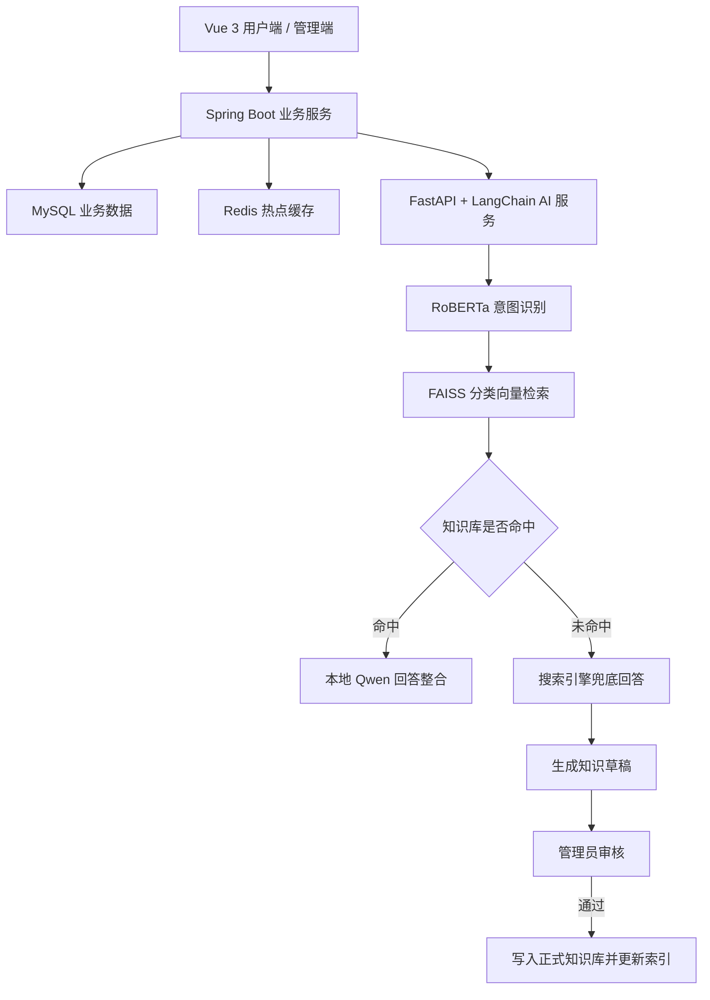

# CampusGenie 校园生活百事通

**基于 RAG 的校园智能问答与知识管理平台**

CampusGenie 是华南理工大学课程实训团队项目，面向师生在食堂、图书馆、校车、报修和教务等场景中的信息查询需求。项目整合校园多来源知识，通过意图识别、向量检索与本地大模型生成回答，并提供知识贡献、审核管理和社区交流功能。

## 项目背景

校园服务信息分散在学校官网、公众号和学生手册中，查询时经常需要在多个入口之间切换。通用大模型的回答也需要核对校园信息的来源和适用范围。

CampusGenie 将这些信息整理为统一知识库，优先检索已有校园知识，再由本地模型整合回答。对于知识库未覆盖的问题，系统调用搜索引擎补充信息，并将回答生成的知识草稿交由管理员审核后入库。

## 核心功能

| 模块 | 功能 |
| --- | --- |
| 智能问答 | 自然语言提问、意图识别、分类向量检索、本地模型回答整合 |
| 多轮对话 | 保留最近几轮对话历史，支持“它在哪里？”“周末也开放吗？”等连续追问 |
| 搜索兜底 | 知识库未命中时调用搜索引擎，生成待审核的知识草稿 |
| 知识贡献 | 用户提交校园问答，由管理员审核后写入正式知识库 |
| 知识管理 | 知识条目增删改查、分类管理、Excel / JSON 批量导入、批量审核 |
| 热点推荐 | 定时统计高频查询，通过 Redis 缓存展示热点问题 |
| 用户与权限 | 登录注册、用户认证、权限管理和历史对话 |
| 回声岛社区 | 多级兴趣社区、内容发布、情绪天气展示和校园经验沉淀 |

实训阶段已整理 **2 万余条校园问答对**，数据来源包括学校官网、系列公众号和学生手册。此数字描述团队构建的知识库规模，不表示当前仓库包含全部数据。

## 技术栈

| 层级 | 技术 | 用途 |
| --- | --- | --- |
| 前端 | Vue 3、Vite、Pinia、Vue Router | 用户端与管理端页面、状态管理和路由 |
| 业务后端 | Spring Boot、MyBatis | 用户权限、知识管理、审核流程、热点统计及查询日志 |
| AI 服务 | FastAPI、LangChain | 意图识别、检索与回答生成的流程编排 |
| 意图模型 | RoBERTa | 校园问题的 10 类意图分类 |
| 生成模型 | 本地微调 Qwen2.5-3B-Instruct | 整合检索结果，生成自然语言回答 |
| 业务存储 | MySQL | 用户、知识条目等结构化业务数据 |
| 向量检索 | FAISS | 校园知识的相似度检索 |
| 缓存 | Redis | 热点问题榜单缓存 |

## 系统架构

系统由前端、业务后端和独立 AI 服务组成。业务后端管理账号、知识及审核流程，AI 服务负责意图识别、知识检索与回答生成。

### 意图识别与分类检索

系统首先使用 RoBERTa 判断问题所属的校园场景，再在对应分类内检索知识，减少每次查询需要覆盖的检索范围。

意图识别模块覆盖 10 类校园场景。训练数据基于真实校园问卷样本构建，并采用以下方式扩充表达覆盖：

- 使用大模型生成同义表达与句式改写。
- 构造跨类别易混淆样本，学习相近意图的分类边界。
- 加入口语化、弱标点、无标点及错别字样本。
- 按 8:1:1 划分训练集、验证集和测试集。

模型提取 `[CLS]` 的 768 维表征，输出 10 类意图概率。实训中对比了 Linear 与 FFN-256 分类头，以及全量微调与 LoRA 微调方案。

### 检索增强生成

RAG（Retrieval-Augmented Generation，检索增强生成）将知识检索结果作为回答生成的上下文。CampusGenie 使用 FAISS 检索相关校园问答，再由本地微调的 Qwen2.5-3B-Instruct 整合为自然语言回答。

模型同时利用最近几轮对话历史处理连续追问。知识库未命中时，系统通过搜索引擎补充回答。

### 知识更新与审核

新知识来自管理员导入、用户贡献和搜索兜底生成的草稿。用户贡献与搜索草稿经过管理员审核后进入正式知识库，使知识更新过程可管理，也方便修正已有条目。

## 回声岛 Echo Island

回声岛是平台的社区扩展模块，用于校园生活记录、兴趣交流和经验分享。

| 岛屿示例 | 内容方向 |
| --- | --- |
| 树洞岛 | 情绪表达与倾诉 |
| 爵士岛 | 音乐兴趣与自由表达 |
| 保研岛 | 升学经验与路径分享 |
| 跑步岛 | 运动记录与交流 |

社区支持主岛和子岛的多级结构，并通过“情绪天气”呈现社区氛围，让零散分享逐渐沉淀为可复用的校园经验。

## 本地运行

> 当前 README 根据项目实训材料整理。尚未核对仓库源码，以下部署信息需要按实际代码补齐，不应视为已经验证的安装指南。

运行系统需要准备前端运行环境、Java 与 Python 环境、MySQL、Redis，以及意图识别模型、生成模型和知识向量索引。具体版本与资源要求以仓库依赖和实际部署配置为准。

| 配置项 | 待补充信息 |
| --- | --- |
| 仓库地址与目录 | GitHub 地址、前端 / 业务后端 / AI 服务的实际路径 |
| 依赖环境 | Node.js、Java、Python、MySQL、Redis 版本 |
| 数据库 | 初始化脚本路径、数据库名与连接配置方式 |
| AI 模型 | 意图模型与生成模型的获取方式、本地路径及设备配置 |
| 知识与索引 | 示例数据、导入方法和 FAISS 索引构建命令 |
| 搜索服务 | 实际采用的搜索服务及所需配置 |
| 启动与访问 | 各服务的安装命令、启动命令、端口与访问地址 |

部署时按以下顺序完成配置：

1. 获取项目代码，按各模块的依赖文件安装环境。
2. 初始化 MySQL，配置并启动 Redis。
3. 准备本地模型，导入知识数据并构建向量索引。
4. 配置数据库、缓存、AI 服务及搜索服务的连接参数。
5. 启动 AI 服务和业务后端，再启动前端。
6. 验证登录、知识问答和管理员审核等核心流程。

真实密码和 API Key 应保存在本地配置中；仓库可提供移除敏感值的配置示例。

## 项目展示

待补充问答页面、管理员知识管理页面和回声岛社区的截图，以及演示视频或在线体验地址。

## 团队分工

| 成员 | 主要负责内容 |
| --- | --- |
| 卢满江 | 意图识别模型训练及后端开发、项目文档与推进 |
| 黄泓源 | 校园问答业务后端、数据库设计及部分前端页面 |
| 丘紫珊 | RAG 服务、知识数据收集清洗、本地模型回答整合与搜索兜底 |
| 覃若君 | 用户端与管理端页面、回声岛社区前后端开发 |

团队成员共同参与部分接口联调、功能测试与异常测试。

## 参与贡献

欢迎通过 Issues 反馈问题或提出功能建议，也可以通过 Pull Request 提交改进。反馈时请尽量说明复现步骤、运行环境及实际表现，避免上传账号凭据和真实用户数据。

## 许可证

本项目采用 **MIT License**。团队确认授权并在仓库根目录添加 `LICENSE` 文件后，以该文件中的正式条款为准。

第三方代码、模型权重和数据遵循各自的许可与使用条件。学校官网、公众号和学生手册等来源的内容，不因项目代码采用 MIT 而自动获得相同的再分发授权。
